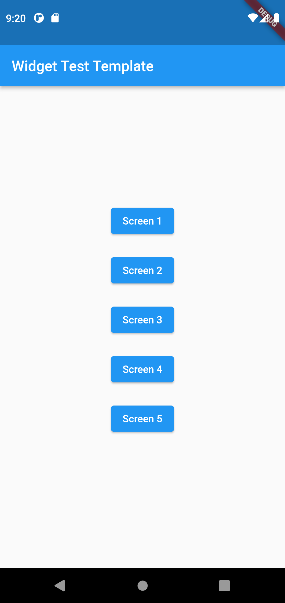

# Widget Test Template

When we create a screen or use a widget, we want to try the different configurations and looks. This template project is used to test the screen easily.

The main.dart is not to be changed. It has 5 buttons. Each button will load a different screen, which is defined in src/Screen[x].dart.

The main screen.

Screen 1.
